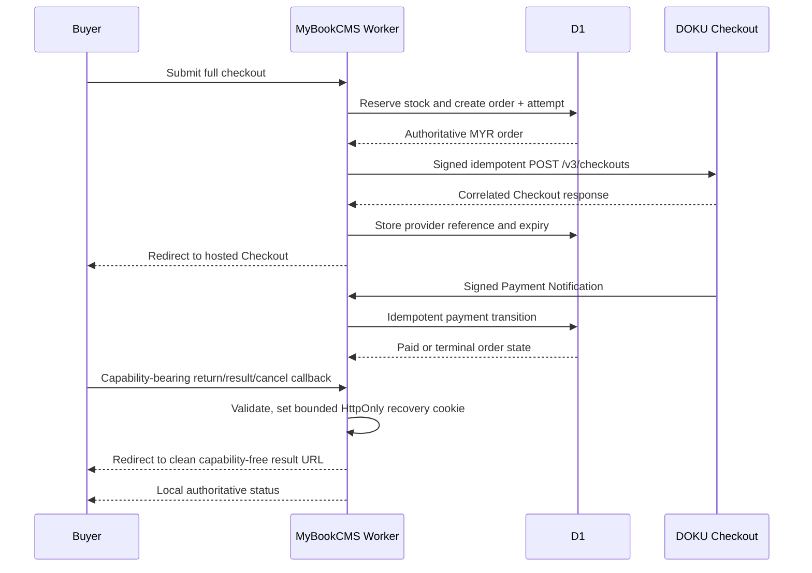

# PLAN — MyBookCMS Malaysia Delivery

## Outcome

MyBookCMS is an independent Malaysia-market commerce CMS. Public storefronts
use one `ms-MY` document language with a controlled Malay/English market voice;
the admin uses Indonesian with common English technical terms. All persisted
money is integer sen and all public money is formatted as MYR.

## Implemented workstreams

1. Isolate the repository and local D1 under the MyBookCMS identity.
2. Limit checkout to COD and manual bank transfer.
3. Quote domestic shipping from D1 postcode zones and inclusive weight bands.
4. Support Peninsular Malaysia, Sabah, Sarawak, and Labuan.
5. Keep Pengiriman manual: local queue membership and status markers only;
   shipment evidence is communicated directly through WhatsApp.
6. Remove inherited external logistics, automatic payment, Meta Commerce feed,
   TikTok, and obsolete partial-lead runtime surfaces.
7. Seed fictional Malaysia catalogue, bank, and shipping data for preview.
8. Localize the full public storefront and retain Indonesian admin operations.
9. Verify schema, unit tests, type checks, build, API flows, and browser-visible
   desktop/mobile pages before release.
10. Search an official local Malaysia city/state/postcode snapshot during checkout.
11. Prefer editable state/WP weight-band rates before the broad-zone fallback.
12. Keep one adaptive Malaysia-market public voice without a language selector.
13. Publish one hybrid home/product presentation; keep legacy bilingual columns
    dormant for forward-migration compatibility.
14. Let a buyer check the current order status with the checkout-issued
    capability without exposing customer, address, courier, or tracking data.
15. Let operators edit a trusted Malaysia destination and MYR shipping cost;
    re-quote actual persisted item weight and refresh the order total atomically.
16. Restore AdsBookCMS-aligned Meta Pixel/CAPI and Google GTM/Ads configuration
    with Malaysia identity, MYR values, server-authoritative Purchase timing,
    encrypted Meta credentials, and a retryable deduplicated CAPI outbox.
17. Publish a read-only, variant-level Google Merchant RSS feed from the
    published MyBookCMS catalog; keep Merchant Center submission, approvals,
    and shipping configuration outside the CMS.

## Accepted DOKU workstream status

18. Delivered locally: every buyer entry point converges on the canonical full
    checkout (REQ-214).
19. Delivered locally: one optional DOKU Malaysia hosted Checkout adapter serves
    senangPay/DOKU merchants while COD/manual transfer remain independent.
20. Delivered locally: encrypted provider configuration and an append-auditable
    attempt lifecycle store no raw provider/customer payload.
21. Delivered locally: exact-raw-byte DOKU Global request and notification
    signatures exclude Cards-only signature schemes. A-221R implements the
    accepted narrow response-envelope compatibility profile for Checkout
    create/retrieve and passed a redacted sandbox transport re-smoke.
22. Delivered locally: signed notification truth and strictly correlated
    Checkout retrieve truth drive monotonic transitions and bounded
    reconciliation; browser redirects do not.
23. Delivered locally: authoritative DOKU success owns the online-order Purchase
    while COD/manual timing remains unchanged.
24. Delivered locally: A-220 links the operator-accepted bilingual DOKU
    disclosure beside its conditional email field and records installation,
    observability, and release controls. A-221 owns provider sandbox evidence;
    neither local delivery nor sandbox approval authorizes production.

## DOKU Malaysia architecture

The official senangPay integration guide routes migrated merchants to the
[DOKU Malaysia API](https://guide.senangpay.com/doku-api-integration-guide).
MyBookCMS therefore implements one DOKU Global API boundary, not parallel DOKU
and legacy senangPay clients. Hosted `POST /v3/checkouts` is selected over
direct Payment/Cards APIs so DOKU owns the FPX/e-wallet/card picker and sensitive
payment interaction. The current API family version must be pinned per endpoint
from the [official DOKU Malaysia reference](https://doku-developers.apidog.io/),
never inferred from another API family.

### Data ownership

- `payment_provider_configs`: one DOKU configuration per install, environment,
  Client ID, API Key ciphertext, Secret Key ciphertext, enabled channel policy,
  configuration revision, and timestamps. Ciphertext is provider-bound with
  authenticated additional data; no secret preview or plaintext column exists.
- `payment_attempts`: one or more attempts per order, with a unique local UUID,
  merchant invoice, idempotency identity, environment, provider reference,
  checkout URL, expiry, channel, provider status/state, local status, bounded
  error class, and lifecycle timestamps. A new attempt is allowed only for an
  eligible retry on the same order.
- `payment_events`: deduplicated notification/reconciliation facts sufficient
  to audit transitions—event identity, attempt, source, resulting status, and
  receipt time—without raw customer payloads, credentials, signatures, or full
  response bodies.

All monetary columns remain integer MYR sen. Conversion to DOKU's decimal MYR
request shape happens only in the transport adapter; a strictly validated
Checkout response or signed notification with another currency or amount does
not mutate the order.

### Server contracts

- `POST /api/submit-order` keeps one order-persistence boundary. DOKU selection
  creates the local order/attempt first, then invokes the provider and returns a
  same-origin redirect instruction only after response authentication.
- `POST /api/payments/doku/notifications` reads the raw request body once,
  verifies the Global signature/timestamp/target, parses additive JSON fields,
  and applies one idempotent lifecycle transition before acknowledging `2xx`.
- `/payment/doku/return`, `/payment/doku/result`, and `/payment/doku/cancel`
  accept only the checkout-issued order capability. A callback query is
  validated and exchanged server-side for a bounded Secure HttpOnly SameSite
  recovery cookie, then redirected to a clean URL before `BaseLayout`, Ads,
  analytics, or other browser code renders. The routes never trust query status;
  they render local state and may request strictly correlated status reconciliation
  server-side. The capability is absent from links, DOM, referrers, logs,
  analytics payloads, and browser storage.
- The scheduled Worker selects only bounded, due, non-terminal attempts. It
  retrieves and verifies current status, then reuses the same transition
  function as notifications. No cron path owns a second payment taxonomy.

### Failure and stock policy

- A provider initiation timeout leaves one inspectable local attempt; retry
  reuses its idempotency identity when the payload is unchanged.
- A terminal failed/expired payment releases still-reserved stock through the
  existing order lifecycle exactly once. A success cannot be downgraded by a
  late failure, and a terminal failure cannot be revived without a new eligible
  attempt.
- Retrying the same order after a terminal release atomically revalidates and
  re-reserves its persisted items; insufficient stock refuses retry instead of
  creating an unreserved payment attempt.
- Unknown provider states remain pending/attention-required. They are never
  guessed into `paid`, `failed`, or `expired`.
- DOKU API keys and signatures never reach browser code, logs, analytics,
  notification alerts, or persisted raw payloads.

### Deferred scope

Refunds, recurring billing, tokenisation, Cards-only host-to-host payment,
split settlement, payout, BNPL, and a standalone legacy senangPay API adapter
are not part of this plan. Each would require its own accepted requirement and
vendor-contract review.

### Vendor confirmations and remaining sandbox gaps

A-211 pinned Checkout/Retrieve/Notification API versions and exact signature
fixtures from the official reference. Merchant-specific channel enablement,
provider retry behavior, and any reference ambiguity remain A-221 sandbox or
DOKU-support evidence. Code must continue to fail closed rather than guess a
permissive value.

## Release boundary

- Local development and local D1 verification are authorized.
- Remote D1 writes, deployment, DNS, and production publication require a
  separate explicit approval.
- Merchant rates are editable D1 policy, not live quotes from a courier API.
- Reference rates and their evidence are documented in
  `docs/research/MALAYSIA_SHIPPING_2026-08-23.md`.
- DOKU account creation, credentials, webhook registration, sandbox calls,
  production enablement, and live payment/refund activity are external actions
  requiring separate explicit approval.
